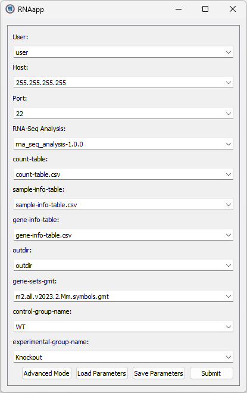

# RNAapp

App for running [`rna_seq_analysis`](https://github.com/linyc74/rna_seq_analysis)



### Server configuration

Create a `~/RNAapp` in the user's name directory, which is the root directory of the RNAapp.
A typical directory structure is shown below:

```
~/RNAapp/
├── .bash_profile
└── rna_seq_analysis-1.0.0/
```

The `.bash_profile` defines all things needed to be activated to run the `rna_seq_analysis-1.0.0`.
An example of the `.bash_profile` is shown below:

```bash
source $HOME/anaconda3/bin/activate rna-seq 
export PATH=$PATH:$HOME/opt/GSEA_Linux_4.3.3
```

Other files/directories are described as follows:

- `rna_seq_analysis-1.0.0/`: The `rna_seq_analysis` which can be downloaded from [here](https://github.com/linyc74/rna_seq_analysis/releases)
